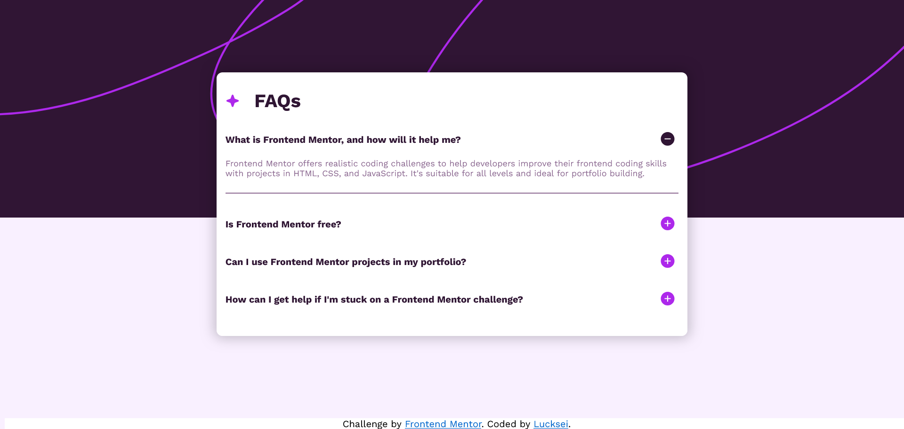

# Frontend Mentor - FAQ accordion solution

This is a solution to the [FAQ accordion challenge on Frontend Mentor](https://www.frontendmentor.io/challenges/faq-accordion-wyfFdeBwBz). Frontend Mentor challenges help you improve your coding skills by building realistic projects. 

## Table of contents

- [Overview](#overview)
  - [The challenge](#the-challenge)
  - [Screenshot](#screenshot)
  - [Links](#links)
- [My process](#my-process)
  - [Built with](#built-with)
  - [What I learned](#what-i-learned)
  - [Continued development](#continued-development)
  - [Useful resources](#useful-resources)
- [Author](#author)
- [Acknowledgments](#acknowledgments)

## Overview

### The challenge

Users should be able to:

- Hide/Show the answer to a question when the question is clicked
- Navigate the questions and hide/show answers using keyboard navigation alone
- View the optimal layout for the interface depending on their device's screen size
- See hover and focus states for all interactive elements on the page

### Screenshot

### Links

- Solution URL: [Add solution URL here](https://your-solution-url.com)
- Live Site URL: [Add live site URL here](https://your-live-site-url.com)

## My process

I based this on the [W3School How To - Collapsibles/Accordion](https://www.w3schools.com/howto/howto_js_accordion.asp) and fleshed it out from there.

### Built with

- Semantic HTML5 markup
- CSS custom properties
- Flexbox
- Mobile-first workflow

### What I learned

Never did an accordion from scratch and the HTML, CSS, JS practice also came in handy. Took longer than what i would like tho...😅 

### Continued development

I dont see too many room for improvements, this project was very straightfoward

### Useful resources

- [W3School How To - Collapsibles/Accordion](https://www.w3schools.com/howto/howto_js_accordion.asp) - This helped me a lot to get starting with how the accordion logic works.

## Author

- Frontend Mentor - [@lucksei](https://www.frontendmentor.io/profile/lucksei)

## Acknowledgments

🐈‍⬛